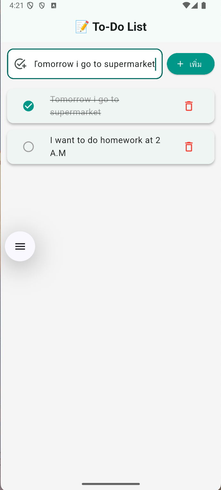
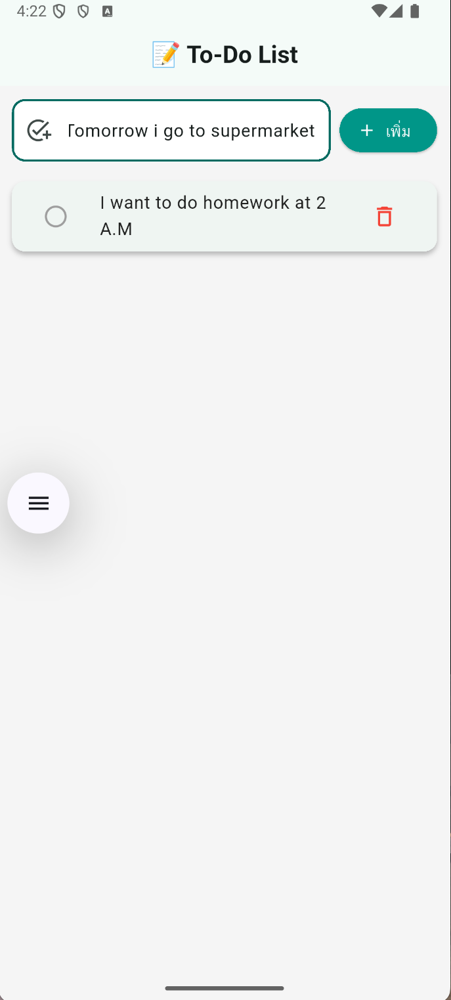

# 📝 To-Do List App with Flutter + Firebase

A beautiful and simple to-do list mobile application built using **Flutter** and **Firebase**.  
Supports task creation, completion, deletion, and real-time cloud sync with Firebase.

---

## 📱 Screenshots

| Task Added | Task Completed | Task Deleted |
|------------|----------------|---------------|
|  |  |  |

---

## 🚀 Features

- ✅ Add and display to-do tasks
- ✔️ Mark tasks as completed
- 🗑️ Delete tasks from the list
- ☁️ Save data with Firebase Firestore
- 🎨 Clean and modern UI

---

## 🔧 Technologies Used

- **Flutter**
- **Dart**
- **Firebase Core**
- **Cloud Firestore**

---

## 📦 How to Run

### ✅ Prerequisites

- Flutter SDK installed
- Firebase project setup
- Android Studio or VS Code

### ▶️ Steps

```bash
git clone https://github.com/oak-jpeg/To-Do-List.git
cd To-Do-List
flutter pub get
flutter run
